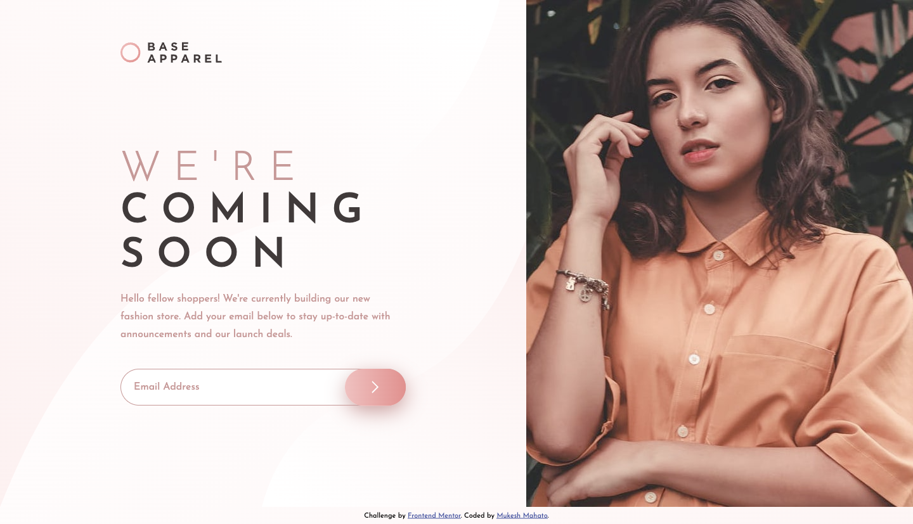
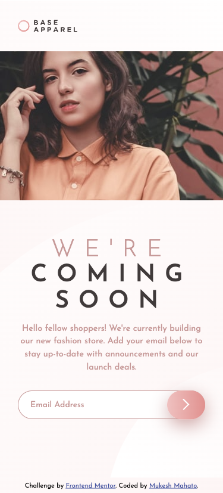

# Frontend Mentor - Base Apparel coming soon page

## Table of content

-  [Overview](#Overview)
-  [Screenshot](#Screenshot)
-  [Links](#links)
-  [Build With](#⚙-built-with)
-  [Author](#author)

## Overview

This is a solution to the [Base Apparel coming soon page challenge on Frontend Mentor](https://www.frontendmentor.io/challenges/base-apparel-coming-soon-page-5d46b47f8db8a7063f9331a0). Frontend Mentor challenges help you improve your coding skills by building realistic projects.

## Screenshot

#### Desktop Design

#### Mobile Design

## Links

-  Solution URL: [Click Here](https://www.frontendmentor.io/solutions/base-apparel-coming-soon-page-using-html-css-and-js-I1jBjO5R8L)
-  Live Site URL: [Click Here](https://iammukeshmahato.github.io/base-apparel-coming-soon-page/)

## ⚙ Built with

-  HTML
-  CSS
-  Flexbox
-  JavaScript

## Author

-  Website - [myselfmukesh.blogspot.com](https://myselfmukesh.blogspot.com/)
-  Frontend Mentor - [@iammukeshmahato](https://www.frontendmentor.io/profile/iammukeshmahato)
-  Facebook - [@iammukeshmahato](https://www.facebook.com/iammukeshmahato)
-  [Message me](https://m.me/iammukeshmahato)
